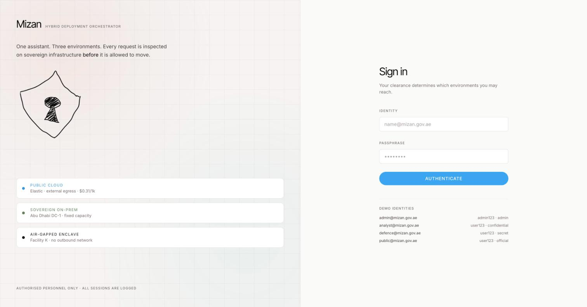
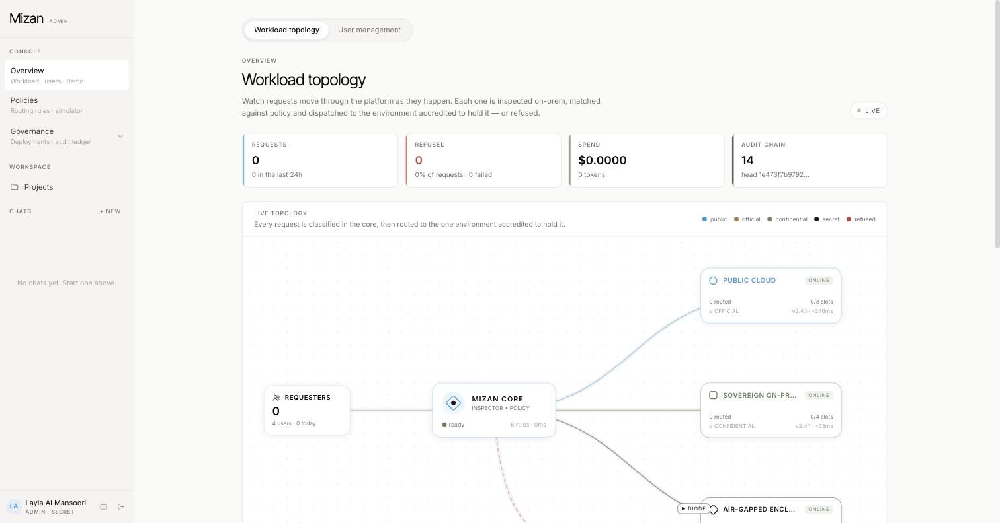
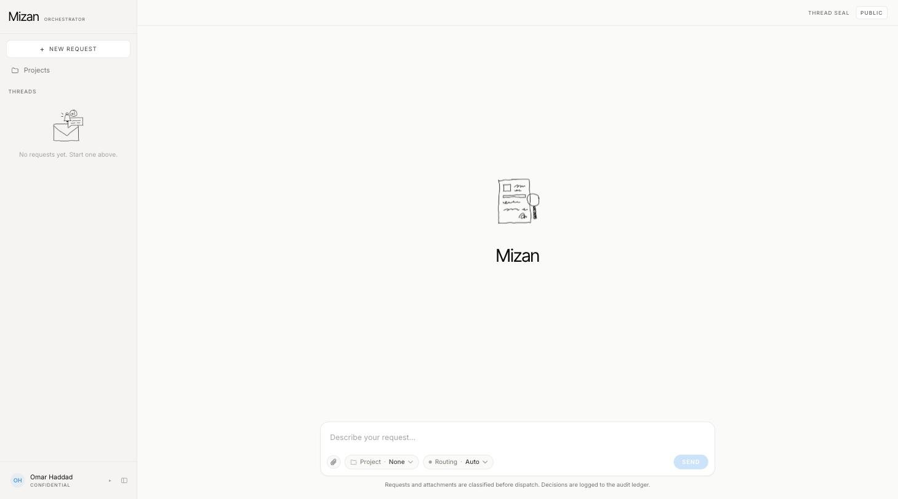
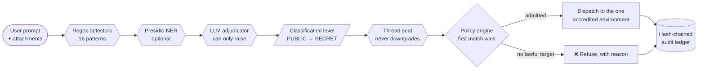

<div align="center">

# Mizan

### ⚖️ Hybrid Deployment Orchestrator

**One assistant. Three environments. Every request is inspected on sovereign infrastructure *before* it is allowed to move.**

Built for **GISEC 2026**

[](https://nextjs.org)
[](https://react.dev)
[](https://www.typescriptlang.org)
[](https://tailwindcss.com)
[](https://github.com/WiseLibs/better-sqlite3)
[](https://github.com/microsoft/presidio)
[](https://mizan-gisec.vercel.app)

**[🚀 Live demo →](https://mizan-gisec.vercel.app)**

</div>

---

## What this is

Government AI has one problem that matters more than any other: **you cannot know a prompt is safe to send to a public model until after you've read it.** Mizan is a policy-enforced router that solves this by inspecting *inside the boundary, before dispatch* — every prompt and every attachment is classified on sovereign infrastructure first, and the classification decides whether the request may leave, where it may go, or whether it is refused outright, with a reason, on the record.

It routes across three environments:

| 🌐 Public Cloud | 🏛️ Sovereign On-Prem | 🔒 Air-Gapped Enclave |
|:---:|:---:|:---:|
| Elastic, external egress | Fixed capacity, sovereign network | No outbound route — loopback only |
| Accredited to **OFFICIAL** | Accredited to **CONFIDENTIAL** | Accredited to **SECRET** |
| Real Anthropic Claude | Local Ollama model | Same model, diode-imported |

A request is never *told* to go somewhere by the user — it is *routed* there by policy, and if no environment is lawfully able to hold it, it is refused instead of downgraded.

---

## 📸 Screenshots

<table>
<tr>
<td width="33%"></td>
<td width="33%"></td>
<td width="33%"></td>
</tr>
<tr>
<td align="center"><sub>Clearance-based sign-in</sub></td>
<td align="center"><sub>Live workload topology (Admin → Overview)</sub></td>
<td align="center"><sub>The chat composer</sub></td>
</tr>
</table>

---

## 🧠 How a request actually flows



1. **Inspect, on-prem, before anything is dispatched.** Three layers stack, and *each one can only escalate the classification, never lower it*:
   - **Regex detectors** (`src/lib/classify/detectors.ts`) — 16 deterministic patterns: Emirates ID, passport, IBAN, Luhn-checked payment cards, payroll/health language, credential material, defence/intel/critical-infra terms, handling markings. Zero network dependency — this is the floor, and it works identically air-gapped.
   - **Presidio NER** (`src/lib/classify/presidio.ts`, optional) — [Microsoft Presidio](https://github.com/microsoft/presidio) running as a local container, adding named-entity recognition on top of regex. Catches identifying information no fixed pattern can (a person's name next to an address, a generic national ID, a crypto wallet). Runs concurrently with the adjudicator call. Fails closed to "unavailable" on any error — never blocks a request.
   - **LLM adjudicator** — reads *meaning*, not just pattern: "asking how a passport works is PUBLIC; supplying a passport number is CONFIDENTIAL." Returns a level, a confidence score, and a one-sentence rationale.
2. **Seal the thread.** A conversation's classification only ever ratchets up. Once a thread has touched SECRET, every later turn in it is treated as SECRET-sealed, even a trivial one — a thread can't be laundered down.
3. **Decide.** The policy engine (`src/lib/policy/engine.ts`) walks rules in priority order, firewall-style — first match wins — and every rule considered, matched or not, goes into a full trace. A matched rule's target is *then* re-checked for real: is it online, accredited, has a free slot, has a deployed model, and does its network binding actually stay inside its boundary? If not, evaluation falls through to the next rule rather than failing closed immediately.
4. **Dispatch**, inside the chosen environment's own network boundary — a binding's HTTP client is physically incapable of reaching a host outside what it's allowed to touch. Point the air-gapped enclave at a hosted API by mistake and it fails closed.
5. **Record.** Classification, routing trace, cost, tokens, latency — all written, plus a hash-chained audit entry that a tamper check can verify end to end.

All of it lives in one place: `src/lib/pipeline.ts`, shared by the live chat API and the scripted admin demo, so both walk the exact same path.

---

## 🏗️ Backend architecture

Mizan is a **single Next.js process** — the UI and the API are the same deployable, no separate backend service.

| Layer | What it is | Where |
|---|---|---|
| **Framework** | Next.js 15 App Router, React 19, Server Actions for auth/mutations, streamed NDJSON for chat | `src/app/` |
| **Storage** | SQLite via `better-sqlite3`, one file, schema + additive migrations run on boot | `src/lib/db/` |
| **Classification** | Regex floor + optional Presidio NER + LLM adjudicator, merged and escalate-only | `src/lib/classify/` |
| **Policy engine** | Ordered rule evaluation, admission checks, pin guards, full decision trace | `src/lib/policy/engine.ts` |
| **Model providers** | One seam (`getProvider(binding)`) for Ollama, Anthropic, and an offline mock — every binding's fetch is wrapped so it *cannot* reach a host outside its declared network boundary | `src/lib/llm/provider.ts` |
| **Environments** | Live capacity, in-flight counters, simulated network hop per environment | `src/lib/environments.ts` |
| **Deployments** | Signed artefact versions across all three environments; the enclave's path is a literal three-step data-diode ceremony (export → diode → re-hash & activate) | `src/lib/deployments.ts` |
| **Audit** | Every sign-in, route, refusal, policy edit and deployment is a hash-chained entry: `SHA-256(previous hash + this entry)` — a verify pass re-hashes the whole chain and names the first broken link | `src/lib/audit.ts` |
| **Knowledge / RAG** | Per-user Projects with instructions + up to 25 files; small projects go in whole, larger ones are chunked and retrieved with on-prem BM25; every excerpt inherits its file's own classification | `src/lib/projects.ts` |
| **Auth** | HMAC-signed, `httpOnly` session cookie carrying the user's claims directly — no session-table lookup on the read path (see *Deploying elsewhere* below for why) | `src/lib/auth.ts` |

**Design principle that runs through all of it:** the model — any model, at any layer — can only ever *raise* a decision's strictness. Rules set a floor the adjudicator can't talk down; policy admission re-verifies a target even after a rule names it; a thread's seal only goes up. A jailbroken, wrong, or simply unreachable model degrades to *more* conservative behaviour, never less.

---

## 🚦 Classification scheme

| Level | Meaning | Examples | May run in |
|---|---|---|---|
| 🔵 **PUBLIC** | Releasable | general questions | Cloud, On-Prem, Enclave |
| 🟡 **OFFICIAL** | Routine government business | tenders, work emails and phones | On-Prem (Cloud fallback), Enclave |
| 🟠 **CONFIDENTIAL** | Personal, financial or commercial data | Emirates ID, passport, IBAN, payroll, health | On-Prem, Enclave |
| 🔴 **SECRET** | Defence, intelligence, critical infrastructure | `SECRET //` markings, troop movements | Enclave only |

- **Fails safe.** If the adjudicator is down, the detector rules (+ Presidio, if deployed) decide alone and the UI marks the result `RULES ONLY`.
- **Attachments are inspected in full.** Text files only (txt, md, csv, json and similar), up to 3 files of 200 KB each.

## 🧭 Routing policy

Default rules, editable live in **Admin → Policies**:

| Priority | Rule | Action |
|---|---|---|
| 5 | Clearance ceiling (level above requester clearance) | REFUSE |
| 8 | No credential material (keys, tokens) | REFUSE |
| 10 | Secret stays sealed | ROUTE → Enclave |
| 20 | Confidential stays onshore | ROUTE → On-Prem |
| 40 | Official prefers on-prem | ROUTE → On-Prem |
| 45 | Official cloud fallback | ROUTE → Cloud |
| 50 | Public goes to cloud | ROUTE → Cloud |
| 99 | Default deny | REFUSE |

- **Two built-in guards run first**, not editable:
  - A pinned target must be accredited for the thread's seal — **a sensitive thread cannot be downgraded** by re-pinning it.
  - Only SECRET-cleared users may pin the Enclave.
- **A target must pass every admission check** before a ROUTE rule is honoured — accredited, online, has a free slot, has an active model artefact, and its connection stays inside its network boundary. Fail any one, and the engine falls through to the next rule.

## 🌍 Environments

| | Public Cloud | Sovereign On-Prem | Air-Gapped Enclave |
|---|---|---|---|
| Accredited to | OFFICIAL | CONFIDENTIAL | SECRET |
| Slots | 8 | 4 | 2 |
| Cost / 1k tokens | $0.31 | $0.94 | $1.62 |
| Simulated network hop | 240 ms | 35 ms | 12 ms |
| Network boundary | anywhere | private addresses only | **loopback only** |
| Artefact channel | registry pull · TLS | internal mirror · TLS | data diode · manual import |

Each environment has its own model connection (`MIZAN_PROVIDER_<ENV>`, `OLLAMA_HOST_<ENV>`, …). Boundaries are enforced in code, not policy alone — every connection's HTTP client refuses hosts outside its declared boundary, so a misconfigured enclave fails closed instead of quietly leaking.

## 📦 Model deployments & the data diode

**Admin → Deployments.** One signed artefact (`mizan-assistant`) is versioned across all three environments. Cloud and On-Prem get a one-click deploy or rollback; the Enclave gets a literal three-step ceremony — export to removable media, pass it through the one-way diode, re-hash inside the enclave against the manifest, then activate. Every step is custody-logged. Routing depends on deployment: the router won't use an environment with no active artefact, and every answer names the exact version that served it.

## 🔗 Audit ledger

**Admin → Audit ledger.** Every sign-in, route, refusal, policy edit, and deployment is logged and hash-chained (`SHA-256(previous hash + entry)`). **VERIFY CHAIN** re-hashes the entire ledger and names the first tampered entry:

```bash
sqlite3 mizan.db "UPDATE audit_log SET summary = 'tampered' WHERE rowid = 5"
# then click VERIFY CHAIN in Admin → Audit ledger
```

## 📁 Projects (knowledge + RAG)

Every user gets Projects: a name, instructions, and up to 25 text files (200 KB each). Uploads are classified on-prem exactly like a chat prompt — anything above the uploader's clearance, or containing credentials, is refused and logged. Small projects go into context whole; larger ones are chunked and retrieved on-prem via BM25, top excerpts only. Every excerpt inherits its file's own classification, so a chat that pulls in Confidential knowledge is itself marked Confidential and can never reach Public Cloud.

## 🖥️ Admin console

- **Overview** — live topology (load, status, bindings, the diode), reserve/offline controls, headline figures, classification mix, cost by environment, refusals by rule, detector signals seen, and the scripted demo runner.
- **Policies** — a rule editor that warns about unreachable rules and unsatisfiable targets, plus a simulator that dry-runs a hypothetical request and shows the full decision trace.
- **Deployments** — the version matrix, diode import flow, deployment log.
- **Audit ledger** — filters, search, per-entry detail, chain verification.

---

## 🎬 Demo script (~5 minutes)

1. Sign in as **admin** — Overview shows the live topology.
2. **▶ Run demo sequence** — eight scripted scenarios through the real pipeline: Public→Cloud, Official→On-Prem, Confidential→On-Prem, Secret→Enclave, an under-cleared Secret request **refused**, a leaked API key **refused**, a downgrade attempt **refused**, and Official **falling back to Cloud** once On-Prem is saturated.
3. Fill On-Prem's slots, take the Enclave offline — watch the topology react live.
4. **Policies** — simulate CONFIDENTIAL pinned to On-Prem, then to Cloud, and read the trace.
5. **Deployments** — register `v2.5.0`, deploy to Cloud + On-Prem (page flags version drift), then walk it through the diode into the Enclave.
6. **Audit ledger** — Verify chain, tamper a row with the SQL above, verify again.
7. Sign in as **analyst** — open a Confidential thread and watch **Cloud lock** in the routing pill.

## ✅ How the deliverables are met

| Requirement | Where |
|---|---|
| Three simulated environments | `environments` table, `src/lib/environments.ts`, network boundaries in `src/lib/llm/provider.ts` |
| Classification scheme and routing policies | `src/lib/classify/`, `src/lib/policy/engine.ts`, Admin → Policies |
| Router with logged decision and justification | `routing_decisions` (full trace) plus the hash-chained `audit_log` |
| Same artefact versioned in all three, with data-diode import | Admin → Deployments, `src/lib/deployments.ts` |
| Blocked request with reason | the chat refusal card and the policy trace |

---

## 🏁 Run it locally

- **Requires:** Node 20+ and [Ollama](https://ollama.com):
  ```bash
  ollama pull gemma4:e2b
  ```
- **Install, seed, start:**
  ```bash
  npm install
  npm run seed   # fresh dataset — wipes users, threads and the audit ledger
  npm run dev    # http://localhost:3000
  ```
- **Offline, no Ollama:** set `MIZAN_PROVIDER=mock` in `.env.local` — the detector rules classify alone, replies are canned.
- **Optional NER recall layer:**
  ```bash
  docker compose up -d presidio-analyzer   # 127.0.0.1:5002, loopback only
  ```

### Logins

| Identity | Password | Role | Clearance |
|---|---|---|---|
| `admin@mizan.gov.ae` | `admin123` | admin → `/admin` | SECRET |
| `defence@mizan.gov.ae` | `user123` | user | SECRET |
| `analyst@mizan.gov.ae` | `user123` | user | CONFIDENTIAL |
| `public@mizan.gov.ae` | `user123` | user | OFFICIAL |

### Configuration (`.env.local`)

| Variable | Default | Purpose |
|---|---|---|
| `MIZAN_PROVIDER` | `ollama` | `ollama`, `anthropic` or `mock`, for every connection |
| `MIZAN_PROVIDER_<CLOUD\|ONPREM\|AIRGAP\|INSPECTOR>` | — | per-connection override |
| `OLLAMA_HOST`, `OLLAMA_MODEL` | `http://127.0.0.1:11434`, `gemma4:e2b` | add `_<BINDING>` to override one connection |
| `ANTHROPIC_API_KEY`, `ANTHROPIC_MODEL` | — | only allowed on the cloud connection (boundary rules block it elsewhere) |
| `MIZAN_SECRET` | `dev-secret-change-me` | session cookie signing key |
| `PRESIDIO_URL` | `http://127.0.0.1:5002` | optional NER analyzer for the classifier; unreachable degrades gracefully |

---

## ☁️ Deploying elsewhere (what we learned shipping this to Vercel)

The live demo above runs on Vercel, and getting there surfaced three real lessons worth documenting rather than hiding:

<details>
<summary><b>1. Vercel's filesystem is read-only outside <code>/tmp</code> — a file-based SQLite app needs a build-time seed + a runtime copy</b></summary>
<br>

`package.json`'s `vercel-build` script seeds a fresh `mizan.db` into the deploy bundle at build time; `next.config.ts`'s `outputFileTracingIncludes` makes sure that file (and `schema.sql`) actually survives Next's serverless bundling (they're opened via a runtime-built path, which the tracer doesn't follow the way it follows static imports); `src/lib/db/index.ts` copies that seeded file into `/tmp` once per cold instance. **Trade-off, stated plainly:** each serverless instance gets its own independent copy — fine for read-mostly demo data, not a substitute for a real shared database.
</details>

<details>
<summary><b>2. Vercel defaulted to Node 24.x, which SIGABRTs <code>better-sqlite3</code></b></summary>
<br>

```
node[4]: void node::RemoveEnvironmentCleanupHook(...)
Assertion failed: (env) != nullptr
... Statement::~Statement() [better_sqlite3.node]
```

`better-sqlite3` doesn't yet have a stable prebuilt binary for the Node 24 ABI. Fixed by pinning `"engines": { "node": "22.x" }` in `package.json` (and on the Vercel project settings).
</details>

<details>
<summary><b>3. A database-backed session table doesn't survive multiple serverless instances</b></summary>
<br>

The original session design looked up a random token against a `sessions` table — and a session created on one instance was invisible to another, so a plain page navigation could randomly bounce a signed-in user back to `/login`. Fixed by making the session a **self-contained signed cookie**: the user's claims (id, role, clearance, …) are HMAC-signed directly into the cookie, so verifying a session is pure cryptography with zero database read. This fixes auth specifically — it does **not** fix the same class of issue for accumulating data like chat messages or the audit ledger, which is the honest reason a from-scratch production deployment of this architecture would want a real hosted database (Postgres, Turso, etc.) instead of a single SQLite file.
</details>

---

## 🗂️ Key files

```
src/lib/pipeline.ts          inspect → decide → dispatch → record
src/lib/classify/            detectors, the Presidio NER adapter, the model adjudicator
src/lib/policy/engine.ts     rule evaluation, admission checks, pin guards
src/lib/llm/provider.ts      model connections and network boundaries
src/lib/environments.ts      live capacity and status
src/lib/deployments.ts       artefact lifecycle and the diode
src/lib/audit.ts             the hash-chained ledger
src/lib/auth.ts              stateless signed-cookie sessions
src/lib/demo.ts              the scripted scenarios
src/app/admin/*              the console
src/app/chat/*, src/components/*   the chat UI
```

## ⚠️ Limitations

- **One local model** serves all three environments locally (Cloud can use real Anthropic Claude). The separation between environments is real in routing, network boundaries and capacity — everything else about them is simulated.
- **Attachments are text only.** No PDF or Office parsing.
- **Auth is demo-grade.** Salted SHA-256 passwords, no rate limiting, and (per the Vercel notes above) no server-side session revocation — logout only clears the client cookie.
- **The audit chain detects edits and deletions** anywhere before the latest entry. Silently truncating the end needs the head hash anchored somewhere outside the database.

---

<div align="center">

Built with Next.js, TypeScript, and a genuine allergy to letting a model decide its own trust level.

**[🚀 Try the live demo](https://mizan-gisec.vercel.app)**

</div>
